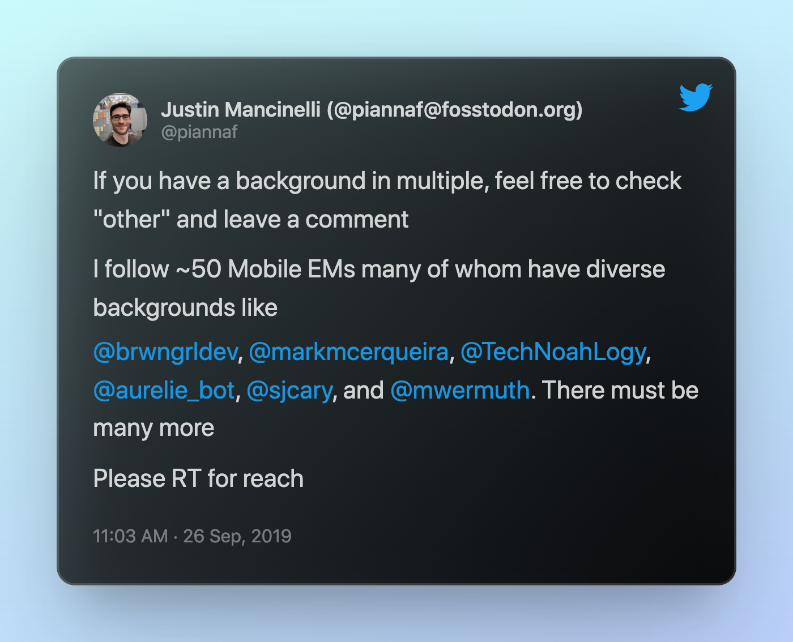
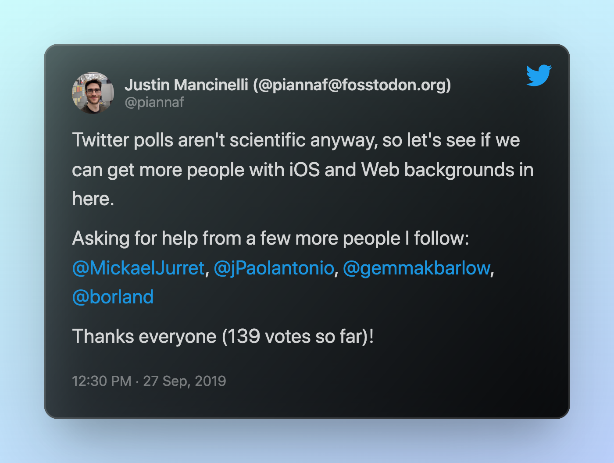
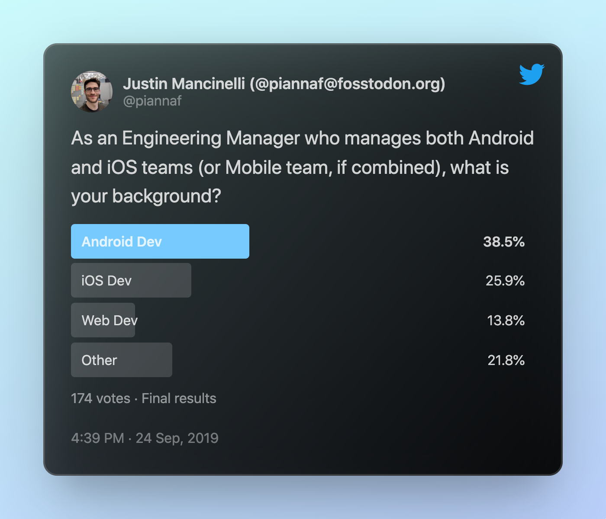

+++
title = "The Diverse Backgrounds of Mobile Managers"
date = 2019-10-17
description = """
My personal experience from working with clients made me think the result of this poll would be iOS Dev > Android Dev > Web Dev > Other. It did not occur to me that the nature of my work would also skew my audience towards people with Android background.
"""
[extra]
+++

## Preamble

A few months ago, I was thinking about my personal/professional development as well as engineering managers I've worked with for client projects. I don't have a mobile background, and a lot of the client managers either had iOS or web backgrounds.

My background is backend development. My professional languages were shell scripting, SQL, C, Python, and Perl. My hobby languages were Ruby, Erlang, Haskell, and Javascript. I've been working as a project manager for mobile app development for the past 3 years. I don't code for work anymore but I've learned enough about Kotlin and Swift to read the PRs and mess around with Kotlin Multiplatform. I'm also managing the design team (I've worked with designers before but I've never been a designer)

I asked my network what their backgrounds were if they are managing a mobile team.

## The Ask

I specifically asked for people who manage *both* Android and iOS because most people start as an IC on one platform, lead a team on one platform, maybe become an EM for that platform, then get promoted or get forced (because of a reorg) to manage both teams. And some people just get dropped managing mobile teams as a career change.

My personal experience from working with clients made me think the result of this poll would be
iOS Dev > Android Dev > Web Dev > Other. But the nature of my work has been historically creating the native Android app for clients after their native iOS app had already been developed. It did not occur to me that the nature of my work would also skew my audience towards people with Android background. But twitter polls are not scientific anyway 🤷‍♂️

I embraced the unscientific nature of twitter polls. When it seemed to stagnate in the low 10s, I begged for more votes from two amazing communities, [EMSG](https://engmanagers.github.io/) and [Lead Dev](https://theleaddeveloper.com). I also pinged some amazing mobile leaders I follow on twitter.

That brought it up to triple digits.

It was stagnating again and I saw the results skewing towards "Other" so begged again. This time for iOS and Web folks. I pinged a few more awesome mobile leaders I suspected/know come from iOS or Web backgrounds.

## The Results

Super super happy with finishing the poll with 174 votes!

Very grateful to everyone who participated, liked, retweeted, and left comments!

## What's Next

This experiment also got me motivated to come up with a conference talk about growing as a manager, managing teams that have different skills than you, and keeping yourself sane along the way. TBD