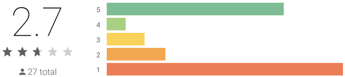
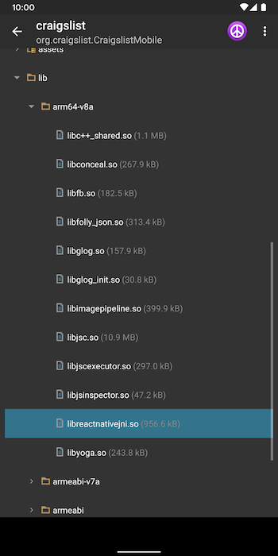
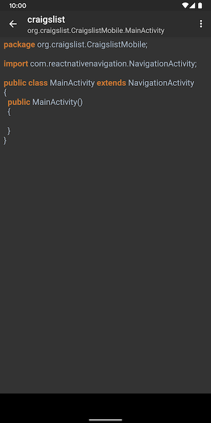

+++
title = "Craigslist Launches Mobile App"
date = 2019-12-05
description = """
Woke up this morning to news that Craigslist launches an official app for iOS; it became the 10th most-downloaded app in the Shopping category one day after launch. It was also released for iOS and Android at the same time (though Android in Beta) so I (naturally for me) wondered if it was a native app.
"""
[extra]
+++

Woke up this morning to news that [Craigslist launches an official app for iOS; it became the 10th most-downloaded app in the Shopping category one day after launch](https://www.launchticker.com/story/craigslist-launches-an-official-app-for-ios-it-is-the-10th).

It was also released for iOS and Android at the same time (though Android in Beta) so I (naturally for me) wondered if it was a native app.

## Ratings

10th most downloaded and great ratings for iOS. 

More than 10,000 installs on Android and terrible ratings.

From my quick scanning of the reviews on Android, a lot of people are disappointed that it requires connecting to a Google account (even if you already have a Craigslist account) and frustrated that the search results on the website are different from in the app (even to the point that some things don't show up in the app with the same search string).

## Is it native?

I signed up for the Android beta, installed the app, and opened it in [Dexplorer](https://play.google.com/store/apps/details?id=com.dexplorer&hl=en_US) before even opening the app.

Tell-tale signs that React Native is in use.

Confirmation that the app is React Native

No, I don't consider React Native to be native. On [the scale of web to native](@/blog/2019-03-27-the-future-of-cross-platform-is-native/index.md), it is almost in hybrid tools territory.

React Native tends to perform better on iOS than Android, though [Hermes is supposed to narrow that gap](https://dev.to/rishikc/react-native-just-got-better-the-new-javascript-engine-is-here-7nl). But given the negative Android reviews are mostly not about performance, that doesn't seem to be the issue.