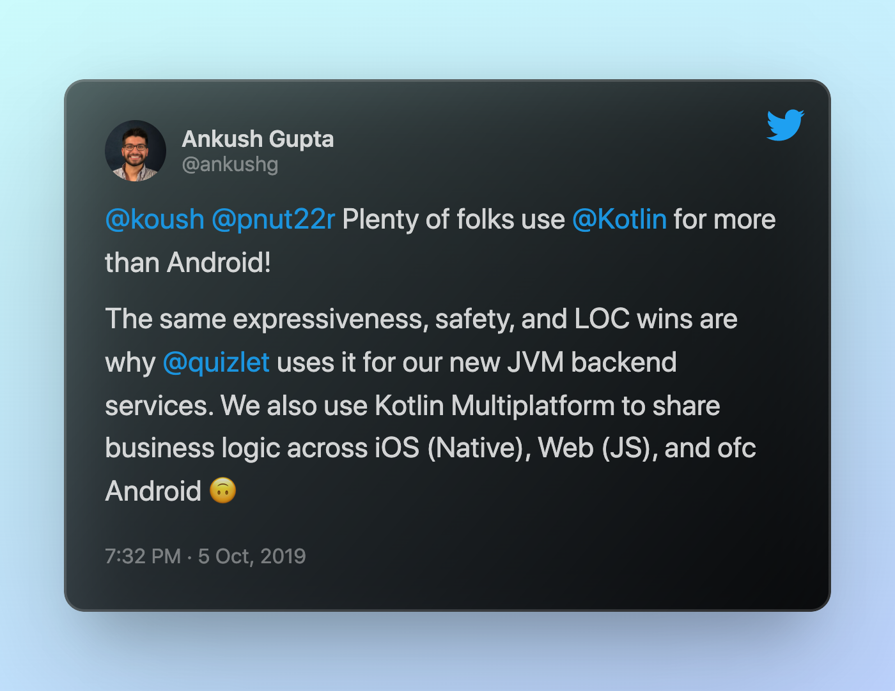

+++
title = "Quizlet Adopting Kotlin Multiplatform"
date = 2019-12-18
description = """
Quizlet's new post iss a super interesting read because it tells the story of trying to share with JavaScript first, thinking about sharing with C++, then finally deciding on Kotlin Multiplatform.
"""
[extra]
canonical_url = "https://dev.to/touchlab/quizlet-adopting-kotlin-multiplatform-51l6"
+++

[@kpgalligan](https://twitter.com/kpgalligan) shared Quizlet's Medium post, [Shared Code at Quizlet: Deciding on Kotlin Multiplatform](https://medium.com/tech-quizlet/shared-code-at-quizlet-kotlin-multiplatform-2ee1b57646c), the day it dropped. 

I then discovered [@ankushg](https://twitter.com/ankushg) had already let that cat out of the bag nearly 2 months earlier:

It's a super interesting read because it tells the story of trying to share with JavaScript first, thinking about sharing with C++, then finally deciding on Kotlin Multiplatform.

I'm a fan of the term "platform citizen" but it's probably a coincidence that they used it too:

> Kotlin Multiplatform promises the ability to write code in Kotlin and have it run as a first-class citizen on each platform.

----

But here are my favorite takeaways:

**General**

> For many businesses, requiring internet connectivity for core product features might be a very reasonable requirement! Quizlet however has a particularly strong affinity for mobile users with limited Internet access.
...
> By focusing our shared code efforts on code based around state management and control flow, we saved our engineering team countless person-hours with minimal time spent on cross-platform threading or concurrency concerns.

**JavaScript**

> these issues resulted in an ecosystem where frontend web developers might have felt comfortable writing shared code, but mobile developers certainly did not feel comfortable consuming it.
...
> We were able to write our most critical business logic in one place, ship it across multiple platforms, and unblock our resource-constrained native mobile teams. Most importantly, we were able to do this without committing to writing our entire client with the same framework.

**Kotlin Multiplatform**

> even our frontend web engineers found themselves impressed by Kotlin.
...
> In early 2019, Quizlet migrated all of our shared code over to Kotlin Multiplatform, and we are using it in production to serve over 50 million monthly active users.

----

Please read the whole thing: [Shared Code at Quizlet: Deciding on Kotlin Multiplatform](https://medium.com/tech-quizlet/shared-code-at-quizlet-kotlin-multiplatform-2ee1b57646c)

And check out their mention in the KotlinConf Keynote alongside a several other great examples of Kotlin Multiplatform in production

{{ youtube(id="0xKTM0A8gdI") }}
<figcaption>Skip to 13:00 for Mobile Multiplatform mentions</figcaption>

----

This post originally written for [Touchlab](https://dev.to/touchlab/quizlet-adopting-kotlin-multiplatform-51l6)

----