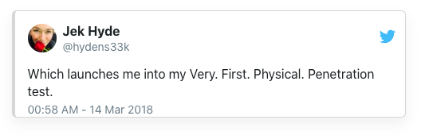

+++
title = "A tale of checksums and client-side security🙀"
date = 2020-01-06
description = """
I was wandering through the intranet at a previous job looking at what other similar teams were up to. I found a password-protected test environment that used a client-side checksum function to validate the password. Here's how I got in without asking.
"""
[extra]
+++

## Chapter 1 - When you come to a fork in the road, take it

<sup>📝 As once said by [Yogi Berra](https://quoteinvestigator.com/2013/07/25/fork-road/)</sub>

I was wandering through the int<strong>ra</strong>net at a previous job looking at what other similar teams were up to and came across a link to their product's test environment (open to the int<strong>er</strong>net). Unfortunately, it was password protected:


<figcaption>URL redacted -- as of this writing it points to a 404</figcaption>

At first glance, I thought it was [basic authentication](https://developer.mozilla.org/en-US/docs/Web/HTTP/Authentication) because of the alert window. On second glance, it was definitely a [`window.prompt()`](https://developer.mozilla.org/en-US/docs/Web/API/Window/prompt) box. And the code looked like this:

```javascript
function promptUserForPassword(pass) {
  if (jesChecksum(pass) != 9887) {
    pass = prompt("Please enter the passkey","");

    if (pass == null) {
      document.location.href = defaultHref;
    } else {
      verifyPassword(pass);
    }
  } else {
    successfulLogin(pass);
  }
}
```

**Since this is client-side authentication, I could just look into `successfulLogin` and force success without any password. But what's the fun in that?**

It was much for fun to see if I could get `jesChecksum(pass)` to equal `9887`. The first hint that it was probably fairly easy is that the function hints the algorithm is a checksum.

## Chapter 2 - Checksums are unsuitable for any kind of security work

<sup>📝 As pointed out by [Jeff Atwood](https://blog.codinghorror.com/checksums-and-hashes/)</sup>

### First, let's consult Wikipedia to find out [what a checksum is](https://en.m.wikipedia.org/wiki/Checksum):

> A checksum or hash sum is a small-size datum from a block of digital data for the purpose of detecting errors which may have been introduced during its transmission or storage. By themselves checksums are often used to verify data integrity, but should not be relied upon to also verify data authenticity.


It's interesting that another name is "hash sum" but, it's very clear from the above quote, the functions you use to hash your passwords aren't the same as a checksum.

### So [what's a hash function](https://en.m.wikipedia.org/wiki/Hash_function)? Back to Wikipedia:

> A hash function is any function that can be used to map digital data of arbitrary size to digital data of fixed size.


Ok, then checksums are a kind of hash function. There are lots of different kinds of hash functions. They can do lots of different processing to generate the hash. The resulting hash can be of different sizes. Most importantly, different hash functions have different properties: speed, reversibility, number of collisions...

Collisions and speed are super important for the hashing functions that back [perl hashes](https://www.perl.com/pub/2002/10/01/hashes.html/), [java hashmaps](https://docs.oracle.com/javase/8/docs/api/java/util/HashMap.html), [python dictionaries](https://docs.python.org/3/tutorial/datastructures.html#dictionaries), and [javascript objects](https://developer.mozilla.org/en-US/docs/Web/JavaScript/Guide/Working_with_Objects). Too slow, and the initial `O(1)` lookup is slow; too many collisions, and lookups will need to `O(n)` traverse the list in the bucket.

### What about those password hashes? Enter [cryptographic hash functions](https://en.m.wikipedia.org/wiki/Cryptographic_hash_function)

Unlike checksums and the hash functions used for associative arrays, Wikipedia tells us:

> The ideal cryptographic hash function has four main properties:
>
> 1. it is easy to compute the hash value for any given message
> 2. it is infeasible to generate a message from its hash
> 3. it is infeasible to modify a message without changing the hash (avalanche effect)
> 4. it is infeasible to find two different messages with the same hash.

\#1 and #2 mean it is much faster to figure out the hash than it is to figure out what the hash came from.

\#3 and #4 make it really hard to triangulate or brute force what the hash came from.

Unlike cryptographic hashes, it's often easy to find checksum collisions, even for more complex algorithms like CRCs ([PDF - Reversing CRC](https://sar.informatik.hu-berlin.de/research/publications/SAR-PR-2006-05/SAR-PR-2006-05_.pdf)).

## Chapter 3 - My crime is that of curiosity

<sup>📝 From [The Conscience of a Hacker](http://www.phrack.org/archives/issues/7/3.txt)</sub>

How can `jesChecksum(pass)` equal `9887`? Here it is:

```javascript
function jesChecksum(str) {
  var primes = [ 2, 3, 5, 7,11,
                13,17,19,23,29,
                31,37,41,43,47,
                53,59,61,67,71,
                73,79,83,89,97];
  var rtn = 0;

  for (i = 0; i < (str.length); i++) {
    tmp = str.charCodeAt(i) * primes[i];
    rtn = rtn + tmp;
  }

  return rtn;
}
```

It may look difficult to solve this without lots of trial and error. After staring at it a bit longer, you'll notice it just takes each letter of the string passed in, multiplies it by a prime at the same position, then adds them all up. 

How does that make things easier? If the string is 1 character, it just needs to have the code `4943.5`. 

The good news is [Unicode](https://home.unicode.org/) does have character codes that high ([4943 is ፏ](https://www.fileformat.info/info/unicode/char/134F/index.htm), [4944 is ፐ](https://www.fileformat.info/info/unicode/char/1350/index.htm)). The bad news is they are all integers so we can't get by with a one character password.

If the string is 2 characters, we just need to solve a nice linear equation `2x + 3y = 9887` where `x` will be the first character of the string, and `y` the second character. The [Integer Diophantine Equations Solver](https://www.hackmath.net/en/calculator/integer-diophantine-equations-solver?input=2x+%2B+3y+%3D+9887&submit=Calculate) tells us there are over 500 integer-pairs that will open the lock (although, some don't correspond to existing unicode characters).

100 is a nice number so I converted each to hex, then looked up each unicode character ([Ī](https://www.fileformat.info/info/unicode/char/12a/index.htm), [ఙ](https://www.fileformat.info/info/unicode/char/c19/index.htm)):
<pre>
x<sub>100</sub> = 298 = 0x12A => Ī
y<sub>100</sub> = 3097 = 0xC19 => ఙ
</pre>

I've seeded the below RunKit example with that and you can change it to try others.


function jesChecksum(str) {
  var primes = [ 2, 3, 5, 7,11,
                13,17,19,23,29,
                31,37,41,43,47,
                53,59,61,67,71,
                73,79,83,89,97];
  var rtn = 0;

  for (i = 0; i < (str.length); i++) {
    tmp = str.charCodeAt(i) * primes[i];
    rtn = rtn + tmp;
  }

  return rtn;
}

// seeded with U+012A and U+0C19
jesChecksum("Īఙ") // = 9887


## Epilogue - Nothing is actually impenetrable

<sup>📝 Elliot says this in [eps1.4_3xpl0its.wmv](https://www.vulture.com/2015/07/mr-robot-recap-season-1-episode-5.html)

I used to think the stuff Elliot does in Mr Robot was entirely fictional. Then I read this thread:

[](https://twitter.com/hydens33k/status/973725064507068416)

The thing is, there are always security holes whether in the physical world or the software world. And software security is harder than physical security because it obeys [different rules](https://hbr.org/2017/05/why-is-cybersecurity-so-hard).

There are benefits to processing some security rules or other server-required constraints on the client-side but any [actual security should be done on the server](https://cwe.mitre.org/data/definitions/602.html). The biggest problem with the test environment I got into was it relied entirely on client side validation for security. I could have just bypassed it. It was't even obfuscated, and, though that won't stop someone who really wants to get in, it probably would have stopped me. By the way, [adding obscurity on top of security](https://danielmiessler.com/study/security-by-obscurity/) is good practice, just don't let obscurity be your only security.

Another big problem with the test site was rolling its own "hashing" function. Security is hard. Secure algorithms are hard. Experts created MD5 as a cryptographic hash function but that got [compromised just a few years later](https://en.m.wikipedia.org/wiki/MD5#Security).

Lastly, even if you do choose the right tool for the job, something may go terribly wrong if you don't use it correctly:


<figcaption>Explain XKCD has <a href="https://www.explainxkcd.com/wiki/index.php/1286:_Encryptic">amazing details </a> on this one