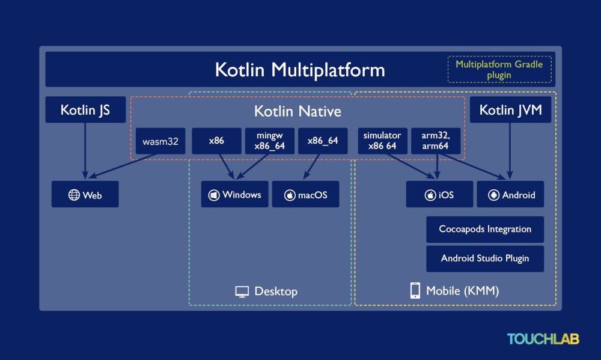

+++
title = "Lions and Tigers and Bears! Clarifying Kotlin Multiplatform naming"
date = 2020-10-16
description = """
After the KMM Alpha announcement, the Twittersphere had some confused faces with questions about how it all fits together. I decided to draw a diagram! 
"""
[extra]
canonical_url = "https://touchlab.co/clarifying-kotlin-multiplatform-naming/"
+++

If you recently learned of Kotlin Multiplatform Mobile from the [Alpha announcement](https://twitter.com/kotlin/status/1300493552997355520), there’s plenty of names to make sense of. 

For starters, there’s **Kotlin Multiplatform** or **KMP**, **Kotlin/Native** is also a thing, did I mention **KMPP**? or what about **Kotlin Multiplatform Mobile** or **KMM** described as an SDK plugin in the Alpha announcement? 

After the KMM (sorry!) Alpha announcement, the Twittersphere had some confused faces with questions about how it all fits together. I decided to draw a diagram! In this post, I’ll clarify the confusion about nomenclature and answer frequently asked questions. Keep in mind, at Touchlab we focus on the native mobile part of the Kotlin Multiplatform equation, so I’ll prioritize there. Let’s jump in!

**Kotlin Multiplatform** (or the **KMP** shorthand) is a capability of the Kotlin language that lets you produce shared code for JS, native apps – iOS, Android, desktops, embedded, as well as the more familiar JVM implementation. KMP sits at the top as the category describing using Kotlin to target different end states while sharing code between them. Initially, when developers heard about KMP and looked at the associated multiplatform docs, there was confusion. Why? Because those docs listed out all the targets that KMP supports and associated configurations. It’s overwhelming for both a new and seasoned developer. KMP is a big category. Some teams like [Quizlet](https://kotlinlang.org/lp/mobile/case-studies/quizlet/) really care about Kotlin JS and Kotlin Multiplatform Mobile because they have a big web and mobile presence. Other teams like [PlanGrid](https://medium.com/plangrid-technology/cross-platform-with-kotlin-native-at-plangrid-3e84b9cfe39c) really pay attention to Desktop because their users (construction workers and managers) rely on desktop. KMP is a diverse ecosystem as the diagram layouts.

The **Multiplatform Gradle plugin**, which is necessary for any multiplatform development you’re doing, sits to the right. 

**Kotlin/Native** is a subset of Kotlin Multiplatform; it’s the compiler for Kotlin that outputs native code for different system architectures. Beneath Kotlin/Native we’ve listed some (there are many more) of the target architecture outputs of different CPUs that the compiler supports. Kotlin/JS has a separate path and doesn’t go through the Kotlin/Native compiler. Kotlin JVM which is what everyone on Android uses also has a separate path and doesn’t go through the Kotlin/Native compiler. Right now, WebAssembly is going through the Kotin/Native compiler, but they’re restructuring it to have its own compiler. Eventually, WebAssembly will be taken out of Kotlin/Native. 

Let’s turn to **Kotlin Multiplatform Mobile** or **KMM**, which is defined as Kotlin Multiplatform for mobile development. The Alpha announcement was a branding exercise to demonstrate KMP for mobile development is maturing and an important focus area. The announcement didn’t get rid of anything else, didn’t change other things, and didn’t change anything drastically in mobile. To that end, we’ve listed the Cocoapods Integration and the Android Studio plugin as examples of additional JetBrains tooling to support mobile development with Kotlin Multiplatform.

----

This post originally written for [Touchlab](https://touchlab.co/clarifying-kotlin-multiplatform-naming/)

----