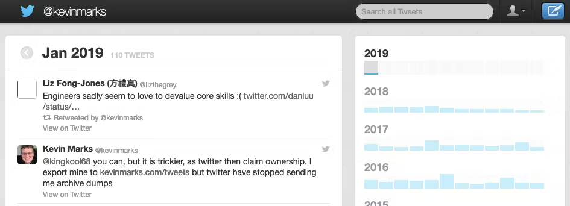
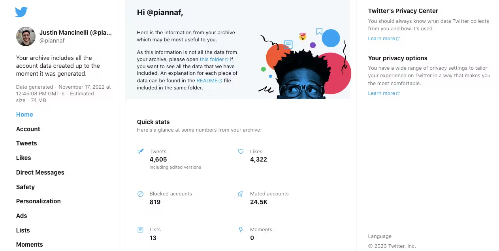
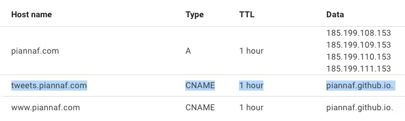

+++
title = "Self Hosting Twitter Archive on Github Pages"
date = 2023-06-14
description = """
TL;DR: I processed my Twitter Archive with Tweetback and host it on a subdomain with Github Pages → [https://tweets.piannaf.com/](https://tweets.piannaf.com/)
"""
[extra]
+++

TL;DR: I processed my Twitter Archive with Tweetback and host it on a subdomain with Github Pages → [https://tweets.piannaf.com/](https://tweets.piannaf.com/)

## Leaving Twitter

My **#TwitterMigration** consisted of a few steps

1. Look at where other folks are going
2. Pick a Mastodon server
3. Stop posting directly to Twitter
    1. Download Twitter archive
    2. Cross-post from Mastodon to Twitter
4. Stop retweeting tweets
5. Start donating to my Mastodon server maintainers
6. Stop liking tweets
7. Publish my Twitter archive

Step 7, publish my Twitter archive, has been a TODO for quite a while. I had downloaded my Twitter archive in Nov 2022, so after a year, it was time to complete it. ✅

(I also had a plan to eventually stop cross-posting, but didn’t have an ETA. Musk decided for me by turning off the API)

## Self-hosting options

With tweet archives having been a thing for so long, and the many technical people leaving Twitter, I expected there to be almost as many Twitter archive publishing options as there are Mastodon clients.

Between at least [2016](https://boffosocko.com/2016/12/05/how-to-own-display-your-twitter-archive-on-your-website-in-under-10-minutes/) and [2018](https://www.digitaldiscovery.sg/blog/host-twitter-archive-github/), the Twitter archive you could download was something you’d be OK simply hosting. Some minor account details, simple search, and mostly a giant list of tweets with timeline metrics on the side. Perfect.

— [https://www.kevinmarks.com/tweets/](https://www.kevinmarks.com/tweets/)

Take a look at my Twitter archive from 2022:

While I’m OK with people knowing how many accounts I’ve blocked and muted, I’m not OK with people seeing Account details like my phone number, viewing my DMs, or looking at superfluous stuff like the privacy sidebar and ads I may have seen. 

Top search results for processing the twitter archive brought me to a [blog post about Tweetback](https://piraces.dev/posts/twitter-own-archive-updated/) and [a news article about Tiny Subversion’s tool](https://www.wired.com/story/how-to-make-public-twitter-archive/). And also a tool last updated in 2018 called [One40](https://github.com/rknightuk/one40) that was updated 10 months ago to tell everyone it is deprecated and everyone should look at [Tweetback](https://github.com/tweetback/tweetback) and [Tiny Subversion’s tool](https://tinysubversions.com/twitter-archive/make-your-own/) 😉.

So it seems there are two tools to choose from these days. Tiny Subversion’s tool is awesome because it is as simple as uploading the Twitter archive and getting back the static site for hosting. However, it doesn’t have the user experience I want. Tweetback is closer in look and feel to the site in the Twitter archive, I like the focus on recent tweets first, and I love the metrics at the bottom. I also feel more confident it will be easier to edit Tweetback’s code in the future to make it more of what I’d like it to be.

## Publishing with Tweetback

Almost as easy as uploading a zip.

There are several tutorials/blog posts about people building with Tweetback. The one I linked to earlier, [“Take ownership of your Twitter data, set-up your own Twitter updated archive in GitHub” by Raúl Piracé](https://piraces.dev/posts/twitter-own-archive-updated/) helped me the most. I found Raúl’s instructions on setting up and building Tweetback easier to follow than the ones in the README. Probably because it’s a bit more conversational and has better text formatting.

## Removing X

Seeing the X logo and linking back to X definitely had to go before going public 🙅‍♂️.

There’s a pesky line in twitter.js that links to the ~~tweet~~ post on ~~Twitter~~ X with the ~~Twitter~~ X logo. I just deleted it 💥.

I thought about creating a config option to toggle whether X is there. I even found that just two weeks before writing this, the [functionality was added to switch over to the X logo](https://github.com/tweetback/tweetback/commit/bb062375898f5f6e4f338681cdfe8aa9f90e36da#diff-36a659af5021ea41791e1943be2d81d731ecac74eec458a97fc955a63751325cR20). But I really don’t want anyone to be heading back there. So DELETE it is. 

## Hosting on Github Pages

There are a lot of posts about hosting a single repo on Github Pages. And [Raúl Piracé’s post](https://piraces.dev/posts/twitter-own-archive-updated/) has a section about showing how he published to [https://tweets.piraces.dev/](https://tweets.piraces.dev/). Good start.

But hosting multiple repos on subdomains? The first post that made me think this could be possible was about [hosting multiple Github Pages on different domains](https://deanattali.com/blog/multiple-github-pages-domains/#step1) 🤔

Then, I read a bunch of posts, comments, and StackOverflow answers that made it sound like it wouldn’t be possible 😦

I wasn’t about to give up, but I was also frustrated with not finding anything on the internet to give me the exact answer. So I gave something a try, and, it turns out, just adding another CNAME like Raúl did, does the trick. 

Notice there’s a CNAME for both my main site (the www subdomain), and the tweets subdomain. Github is doing something they don’t document well, and no one else has really written about so this just works. Well, not “just”. The first time I entered the custom domain for “tweets” it gave a certificate provisioning error. The second time, it worked 🤷

(While waiting for changes to propagate, I continued searching the internet and found [“Github user page and project page in different subdomains of the same domain?” on Stack Overflow](https://stackoverflow.com/a/72640415). Didn’t need it anymore, but good to know it’s there 😃)

----

It's nice to see my "Inbox by Gmail" tweet was one of my most popular tweets. Check it out [https://tweets.piannaf.com/](https://tweets.piannaf.com/)