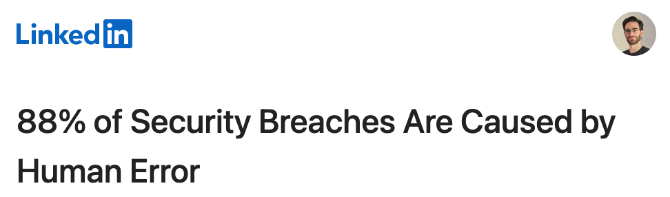
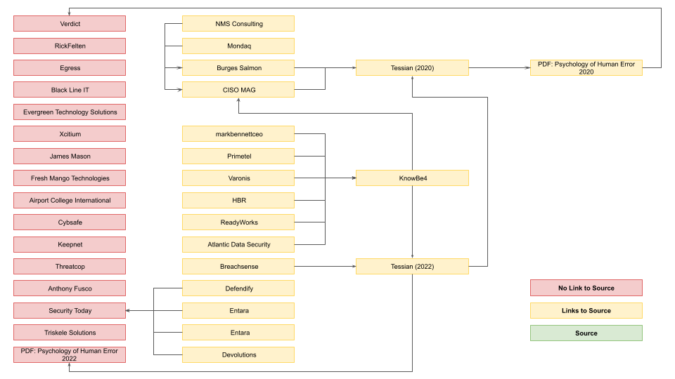

+++
title = "It is Human Error to Follow a Rabbit"
date = 2024-12-18
description = """
How is it possible that "88% of Security Breaches Are Caused by Human Error"? It's not. The truth is far less sensational. And it's from 2018.
"""
[extra]
+++

How is it possible that "88% of Security Breaches Are Caused by Human Error"?

<figcaption>Screenshot of Linkedin newsletter headline "88% of Security Breaches are Caused by Human Error"</figcaption>

It’s not. The truth is far less sensational. And it’s from 2018.

# The Search 

If the statistic is the rabbit, the rabbit hole opens with a search of the quote. The [top 6 search engines][1] are: Google, Bing, Yandex, Yahoo!, Baidu, and DuckDuckGo. [Bing powers Yahoo!][2] and [DuckDuckGo (mostly)][3] so it is not surprising that Bing and Yahoo! overlap a lot. I was surprised that DDG gave 0 results :/ Yandex overlapped mostly with Google, a little with Bing, and a result of its own (which 404’d). Baidu did not return exact phrase match search results, so I did not continue that side quest. In all, I got 48 unique search results, 32 of which were directly related to the quote, and only 14 of them link to a source.

<figcaption>Map of sources and their references to their sources. Following arrows leads to dead ends.</figcaption>

Unfortunately, following links to sources bring us ultimately to [a 2018 article from Verdict][4] which only references “research by risk solutions provider Kroll”, but also without a link. It is, however, a lead, that gets us closer to the actual source 🕵️

More searching… … …

# The Data 

“The data was gathered and published by Kroll, through a request made under the Freedom of Information Act, and analysis of publicly available ICO data” according to [ICC-CSS][5]. And this has a link to [a press release by Kroll][6], which, is dead and I could not find on their revamped site, or through any internet archives ☹️

I reached out to Kroll directly but have not heard back. One of the people who wrote about this news responded that I should reach out to Kroll. At least I got back one response.

Even so, the data from the ICC-CSS artifle is useful.

1. The 88% number comes from “In the past year [2017-2018] 2,124 reports were attributed to human error, compared to just 292 that were deliberate cyber incidents.”
1. The top 2 “human errors” were “data being emailed to the incorrect recipient (447 incidents), loss or theft of paperwork (438)”. I’d consider “theft” to be “deliberate”, but I guess “paperwork” is not a “cyber incident”.
1. The Healthcare sector had by far the most “incidents” (1,214 vs General Business in 2nd place with 362). Curiously the table of incidents adds up to 3,075 instead of 2,416.
1. “The recent rise in the number of reports is probably due to organisations’ gearing up for the GDPR as much as an increase in incidents.” [Andrew Beckett, Managing Director and EMEA Leader for Kroll’s Cyber Risk Practice]

Since Kroll’s report is no longer accessible, I can only speculate how they interpreted the incidents to categorize them, and to decide they were “human error”. Since this report coincided with the ramping up reporting for GDPR compliance (which came into effect in May 2018), the GDPR may be helpful. The [GDPR definitions][7] section says:

* ‘personal data breach’ means a breach of security leading to the accidental or unlawful destruction, loss, alteration, unauthorised disclosure of, or access to, personal data transmitted, stored or otherwise processed;
* ‘personal data’ means any information relating to an identified or identifiable natural person (‘data subject’)

Perhaps this sort of data in 2017 supported the push for much more sophisticated health records management systems we have today. I’m sure it hasn’t put much of a dent in “human error” because new systems will have their own complexities and failure modes that cause humans to make mistakes or deliberate workarounds to get their jobs done (you know you have).

# The Bottom Line 

LinkedIn’s newsletter headline in 2024 says “"88% of Security Breaches Are Caused by Human Error”, a statement widely attributed to a [2022 report][8](PDF) from Tessian and Stanford, but the number is only referenced in their [2020 report][9](PDF), which links to a [2018 article][4] by Verdict summarizing a metric about “data breaches” that happened in the UK between 2017 and 2018 from [data gathered by Kroll][6] from the ICO, which is no longer available. Only a new FOIA request to the ICO would help us understand why Kroll would decide to attribute 88% of the incidents as “human error”.

That said, I can understand why the headline in 2024 isn’t: “If you squint, 88% of personal data breaches reported in the UK between 2017 and 2018 may be considered human error” 

[1]: https://gs.statcounter.com/search-engine-market-share
[2]: https://arstechnica.com/information-technology/2015/04/microsoft-loses-exclusivity-in-shaken-up-yahoo-search-deal/
[3]: https://duckduckgo.com/duckduckgo-help-pages/results/sources/
[4]: https://www.verdict.co.uk/uk-data-breaches-human-error/
[5]: https://www.icc-ccs.org/icc_test/index.php/1250-data-breach-reports-in-finance-and-insurance-sectors-up-74-in-two-years
[6]: https://www.kroll.com/en-us/intelligence-center/press-releases/data-breach-reports-to-information-commissioner
[7]: https://gdpr-info.eu/art-4-gdpr/
[8]: tessian-research-the-psychology-of-human-error_2022.pdf
[9]: tessian-research-the-psychology-of-human-error_2020.pdf